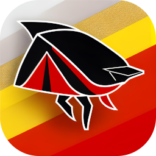

# LanternFly TV Browser



**WARNING**: Early stage product in first iterations of development. Unsuitable for production purpose yet. I'm looking for collaboration on this project. If you're interested, please contact me.

This is a minimal Electron browser that connects to Firebase in the background and gets URL playlists from it for display in full screen.

## v0.0.1-alpha

- Connect to Firebase
- Get a list of URLs from Firebase
- Display the URLs in a full screen browser
- Rotate through the URLs in a playlist

To clone and run this repository you'll need [Git](https://git-scm.com) and [Node.js](https://nodejs.org/en/download/) (which comes with [npm](http://npmjs.com)) installed on your computer. From your command line:

### Under developmet at the moment:

- Automatic browser onboarding from Firebase
- Screen Group management web app
- Automatic builds via Github Actions - testing already in this repo on main

### Known issues:

- The hidden browser is visible and has developer tools open for debugging purposes. This is essential for early testing and debugging purposes.
- On Linux, you may have to delete the ~/.config/lanternflytv folder manually before installation in order to get a fresh unique user id.

### General Direction for development

- [X] Create a minimal Electron app
- [X] Connect to Firebase
- [X] Get a list of URLs from Firebase
- [X] Display the URLs in a full screen browser
- [X] Rotate through the URLs in a playlist
- [X] Create a .deb installer for Linux x64
- [X] Create a .deb installer for Linux arm64
- [ ] Create an installer for Windows
- [ ] Create an installer for MacOS
- [ ] Create a web app for managing screen groups
- [ ] Create a web app for managing URL playlists and group assignments
- [ ] Allow screen group admin to set screen location, dimensions, and rotation
- [ ] Allow screen group admin to set screen group name
- [ ] Allow screen group admin to set screen group URL playlist
- [ ] Allow screen group admin to set default screen group rotation interval
- [ ] Enhance this roadmap
- [ ] Ideas are welcome

## Develop

Make sure you have ESLint and Prettier plugins installed in your VS Code. This will help you keep the code clean and consistent. src/.eslintrc.json is included in the project and set up for both node.js (src/main) and browser (src/renderer) code linting.

```bash
# Clone this repository
git clone https://github.com/tailorvj/lanternflytv
# Go into the repository
cd lanternflytv
# Install dependencies
npm install
# Run the app
npm start
```

## Build locally (x64 Debian Linux and RaspberryPi 4 PiOS)

At the moment you have a script that can build for Linux x64 and arm64. No other OS builds are available yet.
Build your own browser by running the following commands:

```bash
# Clone this repository
git clone https://github.com/tailorvj/lanternflytv
# Go into the repository
cd lanternflytv
# Install dependencies
npm install
# Build the app for Debian Linux x64 (generates a .deb)
npm run build:x64
# Build the app for Debian Linux arm64 (on RaspberryPi 4, for example; generates a .deb)
npm run build:arm64
```

Full build commands are in the package.json file under the scripts section.

*Please note*: The main branch for this project runs automatic builds using Github Actions.

Once the software is built, a .deb file will be available under the dist/lanternflytv-linux-platform folder (ie, lanterflytv-linux-x64 or lanterflytv-linux-arm64).

In order to install, run the following command in a terminal:

for Linux x64:

```bash
$ dpkg -i ./installers/lanternflytv_0.0.1_amd64.deb
```

For Armbian/PiOS:

```bash
$ dpkg -i ./installares/lanternflytv_0.0.1_arm64.deb
```

## Run the app after .deb installation

```bash
$ lanternflytv
```

v0.0.1-alpha: You should see a browser in full screen and another browser window with developer tools open.

## Resources for Learning Electron

- [electronjs.org/docs](https://electronjs.org/docs) - all of Electron's documentation
- [Electron Fiddle](https://electronjs.org/fiddle) - Electron Fiddle, an app to test small Electron experiments

## License

lanternflytv - A full page URL rotator for digital signage
Copyright (C) 2023  Asaf Prihadash TailorVJ.com

This program is free software: you can redistribute it and/or modify
it under the terms of the GNU Affero General Public License as
published by the Free Software Foundation, either version 3 of the
License, or (at your option) any later version.

[GPLv3](LICENSE.md)
